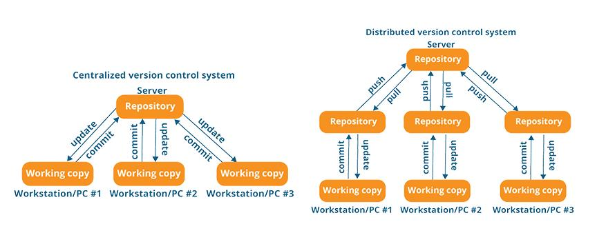

To understand the shift from **Centralized** to **Distributed** systems, you have to look at where the "source of truth" lives and what happens when the cables are unplugged.

## 1. Centralized Version Control (CVCS)

**The "Library" Model**

In a centralized system, there is only one "Great Library" (the server). If you want to work on a file, you effectively "borrow" it from the library.

* **The Single Source:** All project history, branches, and versions live on that one server. Your local computer only holds the current version of the files you are working on.
* **The Connection Dependency:** If you aren't connected to the server, you usually can't commit changes, view the history of the project, or see what your teammates are doing.
* **The Risk Factor:** If the central server's hard drive fails and there are no backups, the entire history of the project—every save point from day one—is gone forever. You are left with only the "current" files people had on their desks.

---

## 2. Distributed Version Control (DVCS)

**The "Mirror Dimension" Model**

Git belongs to this category. In a distributed system, you don't just "borrow" the current files; you **clone** the entire history.

* **The Full Mirror:** When you clone a repository, your computer becomes a complete mirror of the server. You have every commit, every branch, and the full "save game" history stored locally.
* **Offline Freedom:** You can be on an airplane with no Wi-Fi and still commit code, create branches, and look back at what you did three months ago. Your local machine handles all the heavy lifting.
* **Safety in Numbers:** Since every developer has a full copy of the project history, every developer is a walking backup. If the main server (like GitHub) explodes, you can just pick any developer's laptop and restore the entire project history from it.

---

### 🔑 The Deep Intuition Comparison

| Feature | Centralized (SVN) | Distributed (Git) |
| --- | --- | --- |
| **Local Data** | Just a "snapshot" of the current files. | The **entire** database and history. |
| **Commits** | Requires a connection to the server. | Instant and local; sync later. |
| **Speed** | Slower (most actions need the network). | Blazing fast (most actions are local). |
| **Risk** | High (Single point of failure). | Low (Every clone is a full backup). |

---

### 💡 Why this matters for your "Snapshots"

In a **Centralized** system, the server is the one taking the "photos" (snapshots). If you can't reach the server, you can't take a photo.

In **Git (Distributed)**, your own computer is the camera. You take snapshots locally whenever you want. Later, when you are back online, you simply share your "photo album" with the rest of the team. This is why Git is so much more powerful for modern development—it removes the bottleneck of the central server.